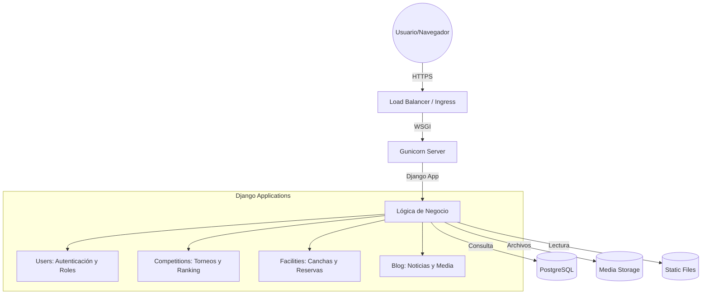
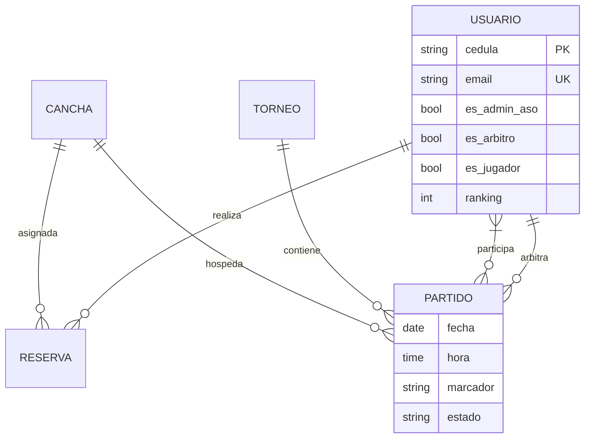

# ASOPADEL BARINAS - Documentación Técnica Integral 🎾

## 📋 1. Introducción

ASOPADEL BARINAS es una plataforma web "Premium" diseñada para centralizar y profesionalizar la gestión de la **Asociación de Pádel de Barinas**. El sistema permite una administración fluida de torneos, sistemas de ranking competitivos, gestión de instalaciones y un motor de noticias en tiempo real, todo bajo una arquitectura segura y escalable.

### Core Tecnológico

- **Framework:** Django 5.x (Python)
- **Base de Datos:** PostgreSQL (almacenamiento persistente)
- **Estáticos:** WhiteNoise con compresión y manifestación cacheada.
- **Entorno:** Contenedores Docker para reproducibilidad total.
- **Infraestructura:** Despliegue optimizado para la nube (Render.com).

---

## 🏗️ 2. Arquitectura del Sistema

### Diagrama de Componentes



### Organización del Código

El proyecto sigue una estructura modular donde cada aplicación encapsula una responsabilidad de dominio:

- **`core/`**: Motor central. Contiene los dashboards dinámicos según el rol, la lógica de la página de inicio y herramientas administrativas globales.
- **`users/`**: Identidad digital. Implementa un modelo de usuario personalizado basado en la cédula venezolana.
- **`competitions/`**: Corazón deportivo. Manejo de cuadros de torneos, lógica de equipos (1v1, 2v2) y recálculo de ranking ELO.
- **`facilities/`**: Operativa física. Control de disponibilidad de canchas en tiempo real y sistema de reservas.
- **`blog/`**: Canal de comunicación. Noticiero con gestión avanzada de imágenes y puntos focales.

---

## 🗄️ 3. Modelos de Datos y Escenarios de Uso

### Esquema Relacional Principal

A continuación se detalla la estructura visual de las entidades más críticas:



### Lógica de Disponibilidad Dinámica
Una característica clave es el método `get_estado_actual` en el modelo `Cancha`, que determina si una instalación está ocupada cruzando datos de:
1. **Mantenimiento manual**: Marcado por administradores.
2. **Reservas Pendientes/Confirmadas**: Del modelo `ReservaCancha`.
3. **Partidos Programados**: Del modelo `Partido` (asumiendo una ventana de 2 horas por encuentro).

---

## 🔒 4. Seguridad y Cumplimiento

El sistema está blindado mediante múltiples capas de seguridad configuradas en `settings.py`:

- **Protección de Datos:**
    - `SESSION_COOKIE_HTTPONLY` y `CSRF_COOKIE_HTTPONLY` activos para mitigar ataques XSS.
    - `SESSION_COOKIE_AGE` limitado a 1 hora de inactividad.
- **Integridad de Cabeceras:**
    - `X-Frame-Options: DENY` contra clickjacking.
    - `SECURE_CONTENT_TYPE_NOSNIFF` activo.
- **Control de Acceso:** Middlewares estrictos de autenticación que redirigen a los usuarios a sus paneles específicos (`dashboard_by_role`) basándose en permisos.

---

## 🎨 5. Diseño y Experiencia de Usuario (UX/UI)

### Sistema de Diseño Premium
- **Modo Oscuro Integrado**: Soporte nativo para temas claro/oscuro con detección automática del sistema.
- **Micro-interacciones**: Transiciones suaves, botones `hover-lift` y tarjetas interactivas.
- **Navegación Inteligente**: Implementación de `Smart Back` que detecta el historial de navegación para evitar "bucles" de retroceso infinitos.
- **Diseño Responsivo**: Adaptación total a dispositivos móviles mediante Bootstrap 5.3 + Custom CSS optimizado.

---

## 🛠️ 6. Herramientas Administrativas Avanzadas

### Gestión de Ranking (Sistema ELO Adaptado)
El proyecto incluye comandos de gestión (`recalculate_stats`) que permiten recalcular el ranking de todos los jugadores basándose en el historial de partidos finalizados, asignando puntos por victoria y penalizaciones por derrota.

### Promoción de Roles
Único en su clase, el sistema permite que el Superusuario promueva o degrade usuarios entre roles (Jugador -> Administrador) **preservando el historial original**. Al degradar a un admin, el sistema consulta el campo `rol_previo_admin` para devolver al usuario a su estado anterior (Árbitro o Jugador).

---

## 🚀 7. Guía de Despliegue y Mantenimiento

### Producción (Render.com)
1. El archivo `render.yaml` orquestra el despliegue automático.
2. `build.sh` realiza la instalación de dependencias, ejecución de migraciones y recolección de estáticos.
3. Se utiliza `dj-database-url` para una conexión segura a la DB en la nube.

### Desarrollo Local
```bash
docker compose up --build
```
Los logs del sistema se almacenan localmente en la carpeta `logs/security.log` para auditoría inmediata de accesos fallidos.

---

**Versión:** 2.1 (Actualizado Enero 2026)  
**Estado:** Producción Optimizada
