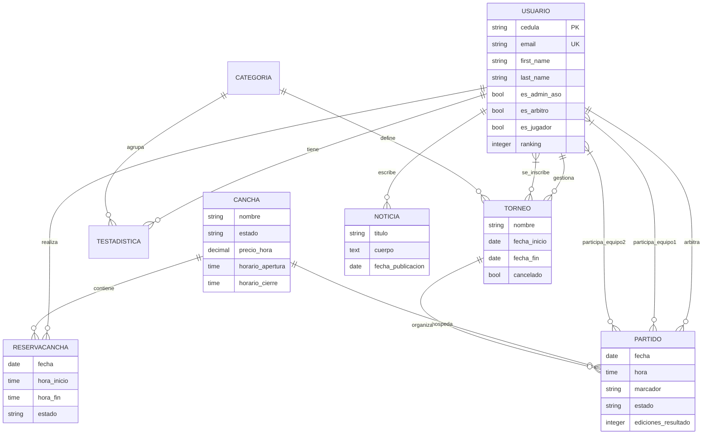

# ASOPADEL BARINAS - Documentación Técnica Completa 🎾

## Tabla de Contenidos

1. [Introducción](#introducción)
2. [Arquitectura del Sistema](#arquitectura-del-sistema)
3. [Modelos de Datos](#modelos-de-datos)
4. [Roles y Permisos](#roles-y-permisos)
5. [Seguridad del Sistema](#seguridad-del-sistema)
6. [Calidad y Testing](#calidad-y-testing)
7. [Configuración y Despliegue](#configuración-y-despliegue)
8. [Guías de Desarrollo](#guías-de-desarrollo)

---

## Introducción

ASOPADEL BARINAS es una aplicación web integral diseñada para la gestión de la **Asociación de Pádel de Barinas**. Permite centralizar la administración de jugadores, árbitros, torneos, canchas y noticias bajo una arquitectura segura y moderna.

### Tecnologías Core

- **Backend:** Django 5.x
- **Base de Datos:** PostgreSQL (Producción) / SQLite o PG (Desarrollo)
- **Servidor Web:** Gunicorn + WhiteNoise (Estáticos)
- **Contenedores:** Docker & Docker Compose
- **Despliegue:** Optimizado para Render.com

---

## Arquitectura del Sistema

### Estructura de Directorios Actualizada

```text
asopadel-old/
├── asopadel_barinas/      # Configuración central (settings, urls, wsgi)
├── core/                  # Dashboards, home y lógica compartida
├── users/                 # Gestión de usuarios (Modelo personalizado con cédula)
├── competitions/          # Torneos y partidos
├── facilities/            # Gestión de canchas
├── blog/                  # Sistema de noticias
├── static/                # Archivos estáticos fuente (CSS, JS, Imágenes)
├── templates/             # Plantillas HTML globales (diseño premium)
├── requirements.txt       # Dependencias de Python
├── render.yaml            # Configuración de Infraestructura para Render
├── build.sh               # Script de construcción para despliegue
├── entrypoint.sh          # Script de inicio para Docker
├── Dockerfile             # Definición de contenedor de aplicación
└── pytest.ini             # Configuración del framework de pruebas
```

---

## Modelos de Datos

### Diagrama de Entidad-Relación

A continuación se presenta el esquema visual de la base de datos:



### Detalle de Modelos por Aplicación

#### 1. Usuarios (`users.Usuario`)

Utiliza la **Cédula** como identificador único principal (`USERNAME_FIELD`).

- **Roles:** Flags booleanos `es_admin_aso`, `es_arbitro`, `es_jugador`.
- **Exclusividad de Roles:** Historial gestionado mediante `rol_previo_admin` para preservar integridad al cambiar permisos.
- **Ranking:** Puntuación entera para el sistema de clasificación competitiva.

#### 2. Competiciones (`competitions`)

- **Torneo:** Entidad principal para eventos. Agrupa jugadores inscritos y gestiona la vigencia temporal.
- **Partido:**
  - **Equipos:** Soporte para Padel (1v1 o 2v2) mediante campos `equipo1` y `equipo2` (ManyToMany).
  - **Control:** Seguimiento de `ediciones_resultado` para auditoría de árbitros.
- **EstadisticaJugador:** Acumula victorias, derrotas y partidos jugados por jugador y categoría.

#### 3. Instalaciones (`facilities`)

- **Cancha:** Gestiona disponibilidad dinámica. El método `get_estado_actual` calcula el estado real cruzando datos de `ReservaCancha` y `Partido`.
- **ReservaCancha:** Permite a los jugadores reservar espacios independientes de los torneos oficiales.

#### 4. Blog (`blog`)

- **Noticia:** Sistema de información con soporte para imágenes con punto focal ajustable (`imagen_pos_x`, `imagen_pos_y`) para garantizar encuadres precisos en el frontend.

---

## Roles y Permisos

1. **Jugador:** Acceso a perfil premium (con edición rápida y recorte de foto), inscripción en torneos y visualización de rankings.
2. **Árbitro:** Capacidad para cargar resultados de partidos asignados. Limitado a **máximo 2 ediciones** por resultado para evitar manipulación de datos.
3. **Administrador:** Gestión total de contenidos (noticias, canchas, torneos) y partidos (creación, edición y cancelación condicional).
4. **Superusuario:** Único rol capaz de gestionar roles de cualquier usuario (Admin, Árbitro, Jugador) a través de un panel unificado con preservación de historial.

---

## Seguridad del Sistema

El sistema implementa capas críticas de seguridad:

- **Gestión de Secretos:** Integración total con variables de entorno (`.env`).
- **Rate Limiting:** Protección contra fuerza bruta en Login (5 intentos/min por IP) usando `django-ratelimit`.
- **Validación de Archivos:** Las imágenes subidas se limitan a 5MB y formatos específicos, con procesamiento mediante `Pillow`.
- **Headers HTTP:** `X-Frame-Options: DENY`, `SecurityMiddleware` de Django activo.
- **Sesiones:** Expiración tras 1 hora de inactividad.

---

## Calidad y Testing

### Framework de Pruebas

Se utiliza **pytest** para la ejecución de pruebas, aunque se mantiene compatibilidad con `manage.py test`.

**Ejecución:**

```bash
# Local con pytest
pytest

# En Docker
docker compose exec web pytest
```

---

## Configuración y Despliegue

### Despliegue en Render (Recomendado)

El proyecto incluye un archivo `render.yaml` que define la arquitectura en la nube:

1. **Base de Datos:** PostgreSQL gestionado.
2. **Servicio Web:**
   - **Comando de Build:** `./build.sh` (instala, migra y colecta estáticos).
   - **Comando de Start:** `gunicorn asopadel_barinas.wsgi:application`.

### Desarrollo con Docker

El entorno local usa Docker Compose para replicar la base de datos PostgreSQL:

```bash
docker compose up --build
```

- **Persistent Data:** Los datos de la DB se guardan en el volumen `postgres_data`.
- **Media/Static:** Volúmenes compartidos para manejar archivos subidos.

---

## Guías de Desarrollo

### Flujo de Trabajo (Git Flow)

1. Ramas: `feature/` o `bugfix/`.
2. Commits: Seguir convención de **Conventional Commits** (`feat:`, `fix:`, `docs:`, `test:`).
3. **Mantenimiento:** Evitar subir archivos temporales, logs o carpetas `__pycache__` (gestionado por `.gitignore`).

---

**Última actualización:** Enero 2026
**Mantenido por:** Equipo ASOPADEL
